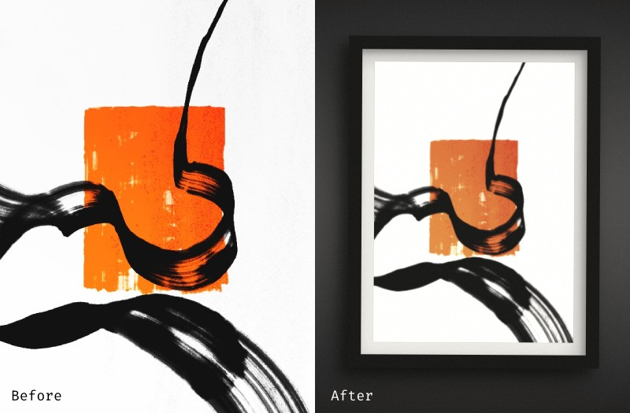

# insitu.js

From the latin phrase *In situ*... insitu.js is a script that I wrote to display artwork as if there were photographs of it hanged on a wall.



I used to do that on Photoshop with my digital illustrations before posting them on social media. Now it's automated. It simulates shadows, perspective and more by dynamically adding randomized CSS to an `` element and its wrapper. It is triggered on click from a button or gallery thumbnails, as shown in the [live demo](https://lxp200.github.io/insitu.js/).

## Highlights

* It's a single JS file with no dependencies. It's vanilla JavaScript.
* It generates CSS, not new pictures with different aspect ratios or anything.
* Thus lightweight, transparent and responsive.
* Basic gallery support.

## How to use

In your HTML:

```html
<div id="insitu-wall">
    <div id="insitu-frame">
        
    </div>
</div>

<!-- Your trigger element can be anything -->
<button onclick="inSitu()">Click me!</button>

<!-- A link to the script -->
<script src="./js/insitu.js"></script>
```

Here's an example of stylesheet for the properties that you might want to keep constant, for example layout related ones. The script will not take care of those.

```css
#insitu-wall {
    align-items: center;
    display: flex;
    height: 60vh;
    width: 100%;
}

#insitu-frame {
    height: 75%;
    margin: 0 auto;
}

#insitu-art {
    height: 100%;
}
```

That's it for the basic requirements.

If you need insitu.js for a gallery and haven't set up anything yet then I got your back! You can add a custom HTML attribute `data-insitu-img` to your trigger elements eg. your thumbnails and the script will do its thing.

Example:

```html
<div id="insitu-wall">
    <div id="insitu-frame">
        
    </div>
</div>

<!-- Your trigger elements must provide the path to the image to display -->


...
```

Note: if your `#insitu-wall` is `display: none` by default (in case you don't want to show anything until a thumbnail has been clicked), then clicking an element that has the `data-insitu-img` attribute will reveal it with `display: flex`.
